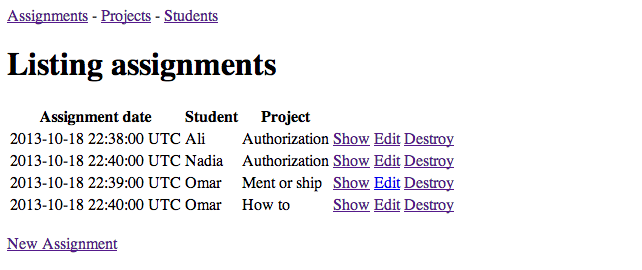
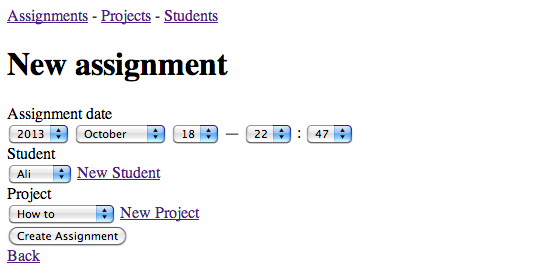

# University

By Ali El-Ashram

## Description

This is a basic app making use of the has_many :through. This makes use of a join model that tracks information about how two sides of a many-to-many relation are connected.

## Information

